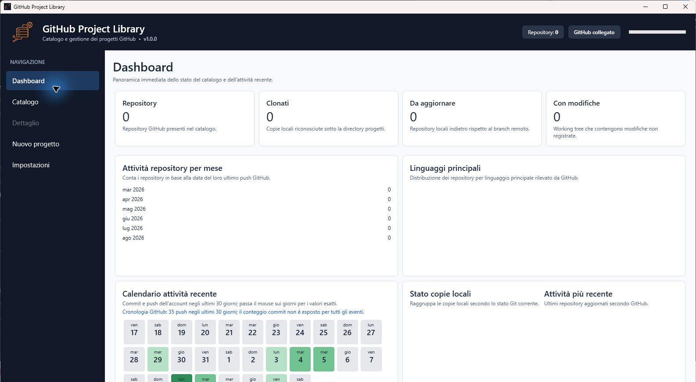
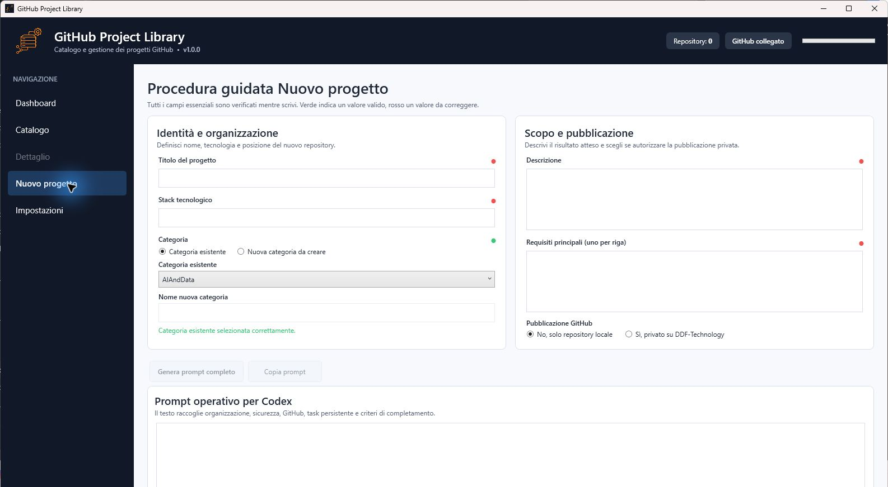
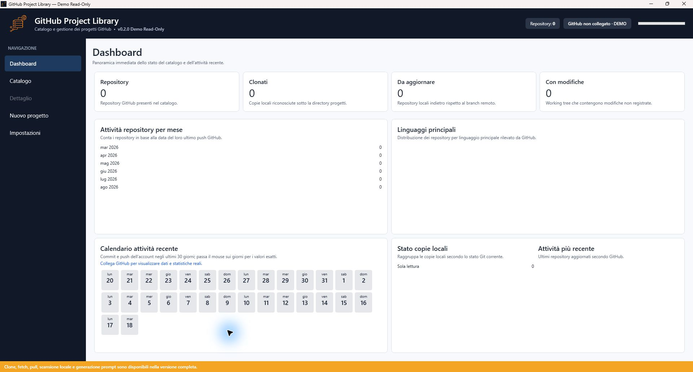
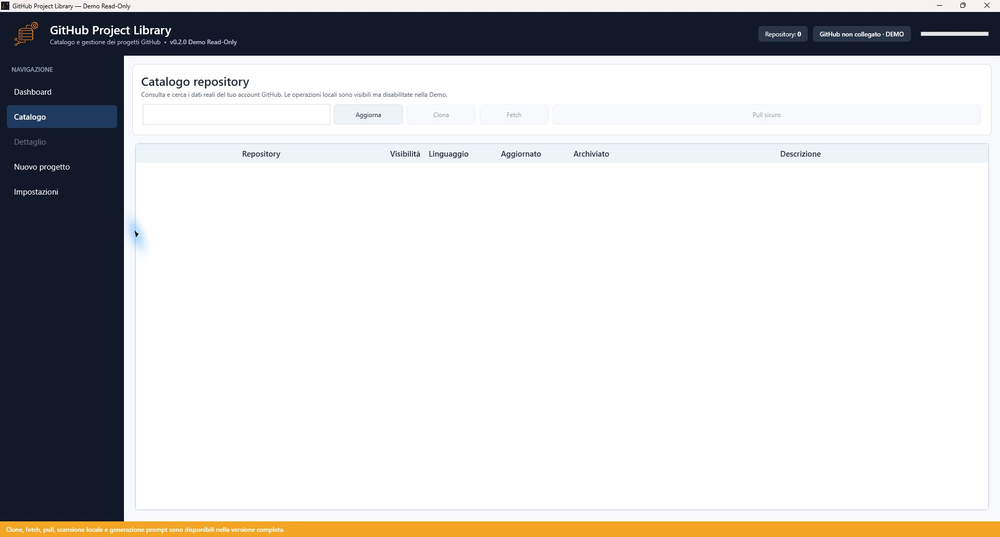
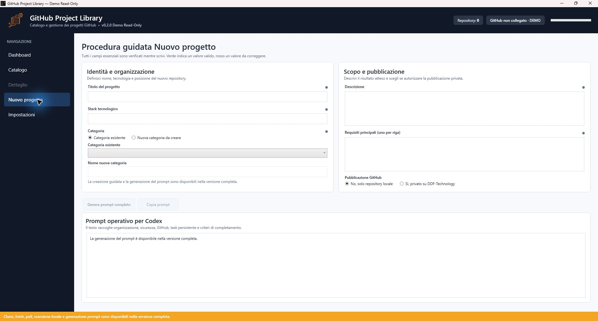
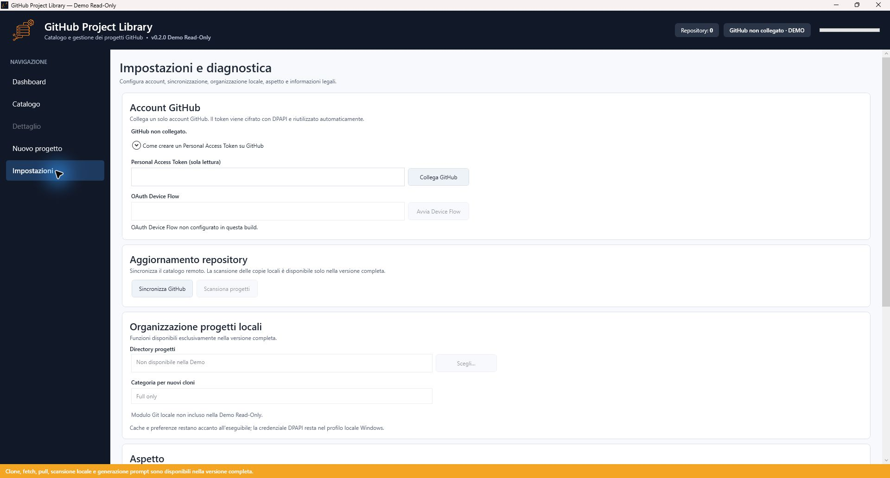

# GitHub Project Library — confronto Full e Demo

La Demo riproduce shell, palette, tipografia, spaziature, card e navigazione della versione Full.
Le differenze sono funzionali e derivano dall'assenza fisica della logica operativa nel binario
pubblico, non da un'interfaccia volutamente impoverita.

## Interfaccia Full

La Dashboard Full aggrega stato GitHub, copie locali, repository da aggiornare, working tree con
modifiche, distribuzione per linguaggio e attività recente.

La procedura guidata Full valida nome, stack, categoria, descrizione e requisiti, quindi prepara un
prompt operativo per Codex e gestisce il flusso locale o la pubblicazione privata autorizzata.

## Interfaccia Demo

La Dashboard Demo può mostrare repository, attività e statistiche reali dell'account GitHub collegato.
Non legge copie locali e non incorpora le implementazioni delle operazioni Git o di gestione progetti.

Il Catalogo espone i dati remoti reali, mentre clone, fetch e pull restano visibili ma disabilitati.

La procedura conserva aspetto e campi della Full, ma generazione e copia del prompt non sono incluse.

La Demo consente il collegamento PAT in sola lettura e rende chiaramente riconoscibili le funzioni
locali e OAuth riservate alla Full.

## Matrice funzionale

| Funzione | Demo Read-Only | Full |
|---|:---:|:---:|
| Dashboard e catalogo esplorabile | Dati GitHub reali | Dati GitHub reali |
| Collegamento GitHub PAT | Sì, sola lettura | Sì |
| Collegamento GitHub OAuth | No | Sì |
| Repository pubblici e privati autorizzati | Sì | Sì |
| Cache SQLite | Sì | Sì |
| Rilevamento copie locali | No | Sì |
| Stato Git e confronto commit | No | Sì |
| Clone, fetch e pull fast-forward | No | Sì |
| README, attività e statistiche | Reali | Reali |
| Apertura in Codex, terminale ed Explorer | No | Sì |
| Procedura guidata Nuovo progetto | Solo presentazione | Operativa |

Gli screenshot Full non mostrano token, nomi di repository privati o percorsi personali. Per la
pubblicazione sul sito si consiglia di presentare prima la Full, poi il confronto funzionale e infine la Demo
scaricabile.
